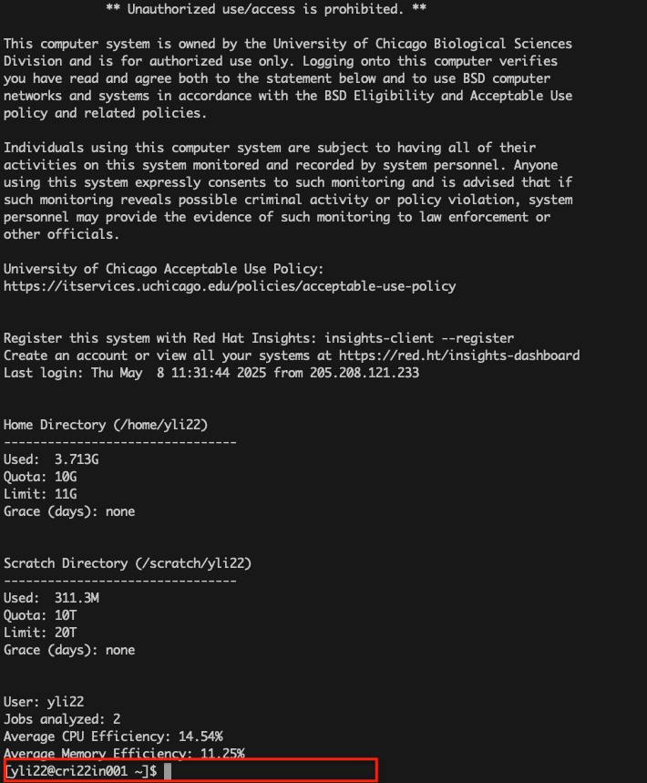
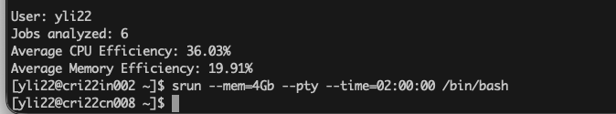
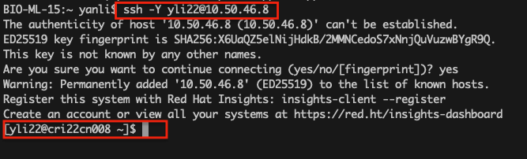
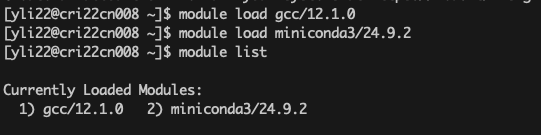
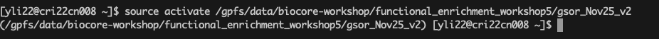
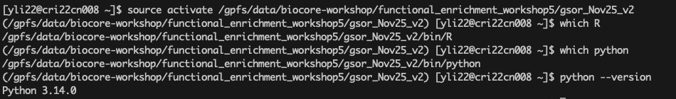
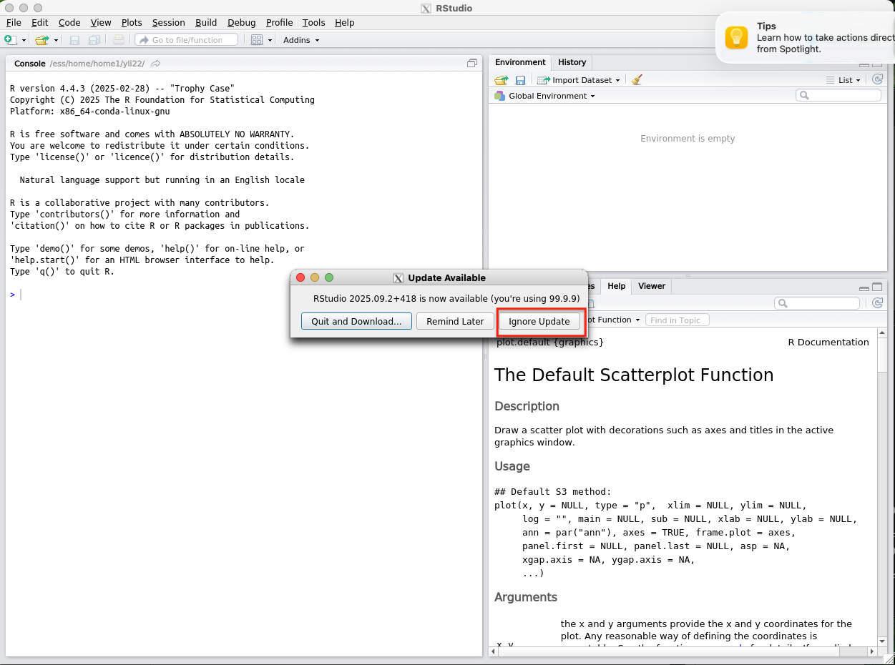
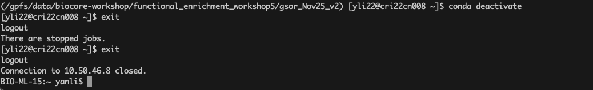

# RStudio Access on Randi (Quick Start & Detailed Guide)

This guide provides step-by-step instructions to access **RStudio** on the CRI HPC system `randi` 
using **XQuartz** (macOS) or an X11 server (Windows). It includes detailed explanations, screenshots, and troubleshooting notes.

---

## Prerequisites

### macOS
1. **Install XQuartz**
   - Download and install from [https://www.xquartz.org/](https://www.xquartz.org/).
   - Log out and back in, or restart your computer.

2. **Enable X11 Forwarding in SSH**
   - Use the `-Y` option when connecting to `randi` to enable trusted X11 forwarding.

### Windows
1. **Install an X11 Server**
   - Recommended: **VcXsrv** ([link](https://sourceforge.net/projects/vcxsrv/)) or **Xming** ([link](https://sourceforge.net/projects/xming/)).
   - Start the X11 server **before** opening your SSH session.

2. **Use an SSH Client with X11 Forwarding**
   - Recommended: [PuTTY](https://www.putty.org/)
   - Settings:
     - `Connection > SSH > X11`
     - Check `Enable X11 forwarding`
     - `X display location`: `localhost:0` (default)

---

## Steps to Access RStudio on Randi

### 1. Log into Randi
Use your BSDID and password:
```bash
ssh your_username@randi.cri.uchicago.edu
```
- After logging in, you should see a screen like:


### 2. Request an Interactive Job

**Without node reservation:**
```bash
srun --mem=4Gb --pty --time=02:00:00 /bin/bash
```

**With workshop node reservation:**
```bash
srun --reservation=workshop --mem=4GB --pty --time=02:00:00 /bin/bash
```
- Wait for allocation. You should see a prompt like:


### 3. Check Network Interfaces
```bash
ip a
```
- Example output:


### 4. Connect via SSH from Local Machine

Open a **new terminal** to maintain your interactive node session:

```bash
ssh -Y yli22@<node-ip>
```
- Example:




> Note: During the workshop, all registered users are assigned reserved nodes, so node availability is not a concern.

### 5. Load Required Modules
```bash
module load gcc/12.1.0
module load miniconda3/24.9.2
module list
export LD_LIBRARY_PATH=/gpfs/data/biocore-workshop/functional_enrichment_workshop5/gsor_Nov25_v2/lib:$LD_LIBRARY_PATH
```

- Example output:



### 6. Activate Pre-set Computational Environment
```bash
source activate /gpfs/data/biocore-workshop/functional_enrichment_workshop5/gsor_Nov25_v2
```
- Output example:



**Verify paths and versions:**
```bash
which R
which python
python --version
which rstudio
```
- Expected output:



### 7. Launch RStudio
```bash
rstudio
```
- This opens RStudio on your local machine via X11 forwarding:



> Select "Ignore update" to continue.

### 8. Close Computational Environment

Please remember to close your computational environment at the end of workshop as below:

```bash
conda deactivate
exit
```
- Example:


---

## Common X11 Issues
### "X11 forwarding request failed"
**Causes & Solutions:**
1. **X server not running** – ensure XQuartz (macOS) or VcXsrv/Xming (Windows) is started.
2. **Access control restrictions** – remote clients may be blocked.

**Quick fix (macOS, less secure):**
```bash
xhost +
```
**Safer fix (macOS):**
```bash
xhost +<node-ip>
xhost -  # restore security after session
```
> Windows: handled by SSH client settings, no `xhost` required.

---

## Troubleshooting RStudio Launch
- **Fails to start**: ensure enough memory (`--mem=4Gb`) and modules loaded.
- **SSH fails**: verify node ping (`ping <node-ip>`), use `-Y` or enable X11 forwarding.

> Always start your X server before initiating SSH to display GUI applications correctly.

---

This detailed guide includes all steps, commands, screenshots, and explanations to ensure participants can follow the workshop smoothly and understand each step's purpose.

